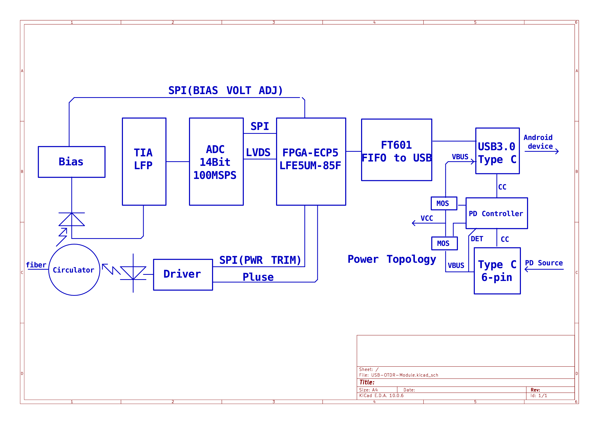

# USB-OTDR-Module

A USB3.0 OTDR (Optical Time-Domain Reflectometer) front-end module designed to be driven entirely by an Android device.

I am designing a compact OTDR acquisition module that connects to an Android phone/tablet over USB 3.0. The module handles the optical front end, pulsing, and high-speed data acquisition only — all trace processing, event detection, and OTDR algorithms run on the Android side. The goal is a low-cost, portable OTDR "dongle" that turns any USB3.0-capable Android device into a fiber test instrument.

## System Architecture

The current architecture is shown below:

The design splits cleanly into an optical/analog front end, an FPGA-based digital control and acquisition core, a USB3.0 bridge to the host Android device, and a dual-source power path.

### Optical front end
- Circulator routing the outgoing laser pulse into the fiber under test and the returning backscatter/reflection to the receiver
- Laser diode driver, generating the transmit pulse, with transmit power trim adjustable over SPI from the FPGA
- APD (avalanche photodiode) receiver with an adjustable bias supply, bias voltage set over SPI from the FPGA
- TIA + low-pass filter (transimpedance amplifier stage) conditioning the APD output before digitization

### Acquisition / digital core
- FPGA: Lattice ECP5 **LFE5UM-85F** — chosen primarily for low cost
  - Generates the transmit pulse timing for the laser driver
  - Drives SPI buses for APD bias voltage adjustment and laser driver power trim
  - Reads back the digitized receive signal over LVDS from the ADC
  - Feeds acquired data to the USB bridge
- ADC: 14-bit, 100 MSPS, connected to the FPGA over LVDS

### USB interface
- USB-to-FIFO bridge: FTDI **FT601**, connected to the FPGA
- USB 3.0 Type-C connector to the Android host device
- The module performs acquisition only; all OTDR trace processing and analysis algorithms run on the Android app

### Power
- Dual power source design over two USB Type-C connectors:
  - USB3.0 Type-C (data) connector to the Android device — can also carry VBUS
  - Dedicated 6-pin Type-C connector for external PD (Power Delivery) power input
- A PD controller manages power sourcing/detection (CC/VBUS sensing) and switches between two power paths via MOSFETs:
  - When external PD power is present, it powers the module and can also supply power back to the Android device through the USB3.0 connector (useful when the phone is acting as USB host and would otherwise drain its battery)
  - When no external power is present, the module draws power from the Android device's own VBUS instead
- Open question: whether a phone's own USB VBUS output can supply enough power for the OTDR module (laser driver + APD bias + FPGA) is not yet confirmed and needs validation once the power budget is measured

## Development Plan

1. System architecture ✅
2. Schematic design ⬅️ **current**
3. PCB layout
4. PCB fabrication
5. Assembly
6. Power path validation (PD source / phone-VBUS switchover, power budget check)
7. Optical front-end bring-up (laser driver, APD bias, TIA)
8. ADC / FPGA acquisition validation
9. USB3.0 throughput and Android-side integration testing
10. Publish progress updates and validation results

## Why I Need Support

The system architecture and initial hardware design are being developed now, but the major cost is the transition from CAD to physical hardware — OTDR front-end components in particular (laser diode, APD, precision analog parts) are not cheap.

Support would be used primarily for:

- PCB fabrication
- PCB assembly
- FPGA, ADC, laser diode, APD, and other optical/analog components
- Fiber test equipment for calibration and validation
- Prototype revisions
- Measurement and debugging

The objective is to use community support to build and validate the first prototypes, then share the results with the community.

## Support the Project

If you are interested in this project and would like to help bring the first prototype to life, you can support the development through:

Donation (TRON / TRX / USDT-TRC20)

Address:
`TWJxB5izJwCg7Q2cTVFkp9ZjamsFmE2UqV`

Every contribution helps cover the cost of fabrication, components, and prototype testing.

If you cannot contribute financially, feedback, design review, testing suggestions, and sharing the project are also very helpful.
